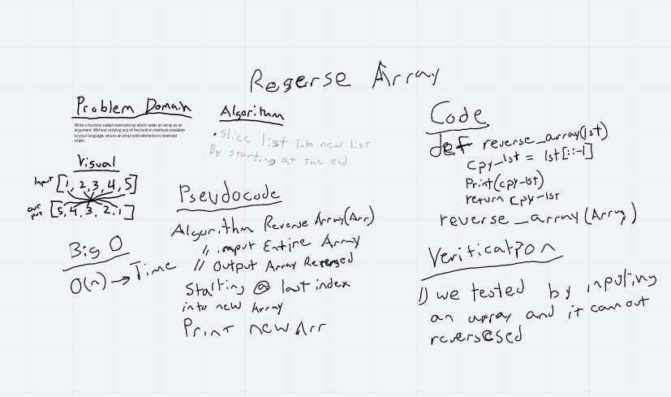
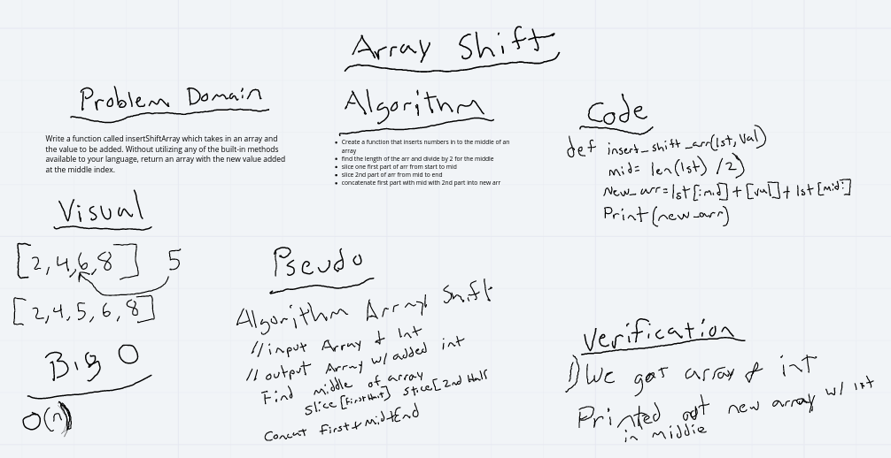

# Data Structures and Algorithms

## Language: `Python`

# Code Challenges Table of Contents


## Code Challenge 07
k-th value from the end of a linked list

[README.md](https://github.com/ticochuck/data-structures-and-algorithms/tree/master/python/challenges/linked_list)

## Code Challenge 06
append, insert before, insert after

[README.md](https://github.com/ticochuck/data-structures-and-algorithms/tree/master/python/challenges/linked_list)

## Code Challenge 05
[README.md](https://github.com/ticochuck/data-structures-and-algorithms/tree/master/python/challenges/linked_list)

## Code Challenge 03 
[Click here to view the README.md](/challenges/array_binary_search/README.md)

## Reverse an Array
Write a function called reverseArray which takes an array as an argument. Without utilizing any of the built-in methods available to your language, return an array with elements in reversed order.

## Approach & Efficiency
I chose to create a new array and slice the original array into the new one stating from the last index.

## Solution
I sliced the original array into a new array starting at the last index:
```
new_arr = arr[::-1]
```


# Shift into an Array
Write a function called insertShiftArray which takes in an array and the value to be added. Without utilizing any of the built-in methods available to your language, return an array with the new value added at the middle index.

## Approach & Efficiency
Find the middle of the array, insert the integer. 

## Solution
I wasn't sure if I could use len to determine the length of the array so I loop through the array and counted the length with a variable called count. 

Once I had the length, I divided by 2 to get the middle point (+1 for odd arrays). Then I used sliced the array from the begining until the middle, and from the middle until the end and concatenated the integer in between. 

```
new_arr = arr[::-1]
```
