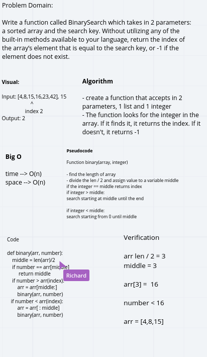

# Binary Search

Write a function called BinarySearch which takes in 2 parameters: a sorted array and the search key. Without utilizing any of the built-in methods available to your language, return the index of the array’s element that is equal to the search key, or -1 if the element does not exist.

## Approach & Efficiency
I wrote 2 functions:
- 1 function iterates over an array until it finds the value. If it does, it returns the index, if it doesn't, it returns -1.

- The other function is a recursive function with the same idea as the one before. 

## Solution
For the first fuction, I loop through the array until it finds the valuw
```
for i in arr:
        if i == n:
            return count
        count += 1
```
