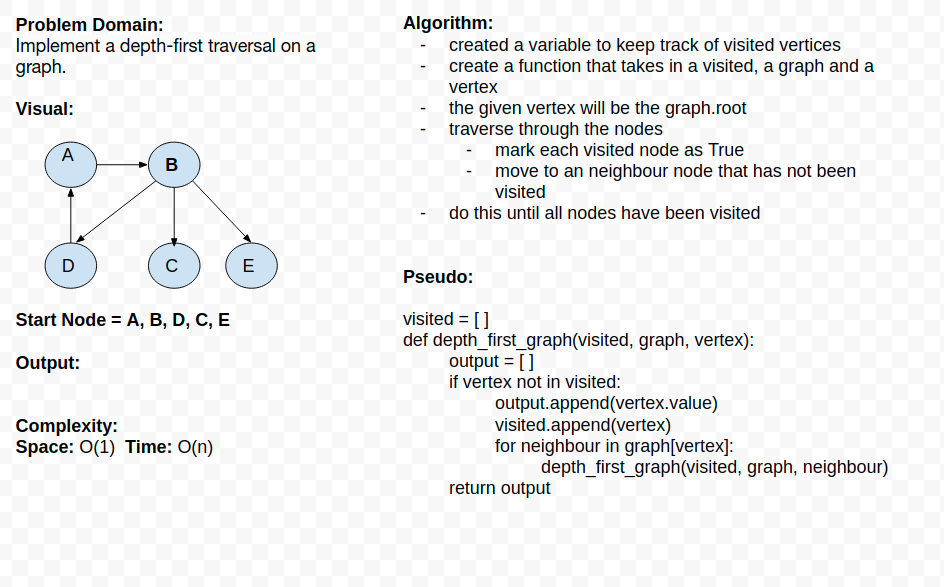

# Depth First Graph

## Feature Tasks

- Create a function that accepts an adjacency list as a graph, and conducts a depth first traversal. Without utilizing any of the built-in methods available to your language, return a collection of nodes in their pre-order depth-first traversal order.

## White Board

Code Challenge 39

## Author

[Chuck Li Villalobos](https://github.com/ticochuck)