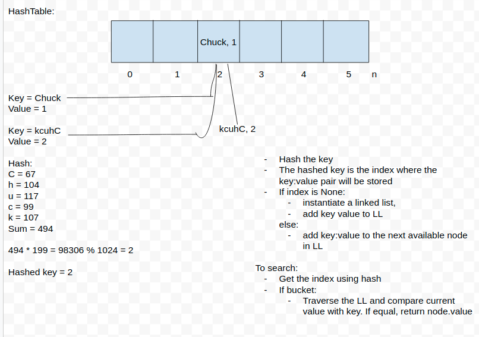

# Hash Table

### Code Challenge #30
Implement a Hashtable with the following methods:

- add: takes in both the key and value. This method should hash the key, and add the key and value pair to the table, handling collisions as needed.
- get: takes in the key and returns the value from the table.
- contains: takes in the key and returns a boolean, indicating if the key exists in the table already.
- hash: takes in an arbitrary key and returns an index in the collection.

### White Board 

### Tests 
1. Adding a key/value to your hashtable results in the value being in the data structure
2. Retrieving based on a key returns the value stored
3. Successfully returns null for a key that does not exist in the hashtable
4. Successfully handle a collision within the hashtable
5. Successfully retrieve a value from a bucket within the hashtable that has a collision
6. Successfully hash a key to an in-range value

## Author

[Chuck Li Villalobos](https://github.com/ticochuck)