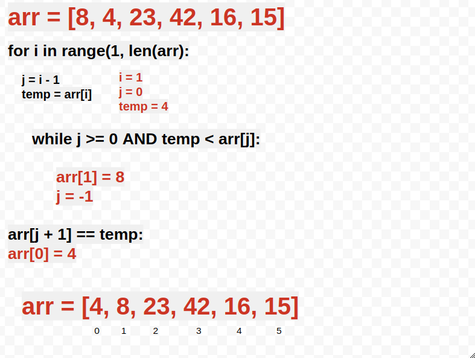
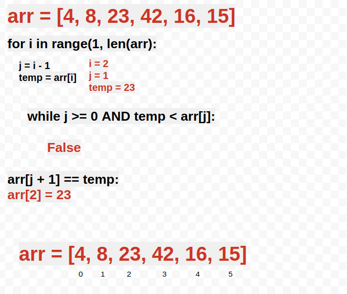
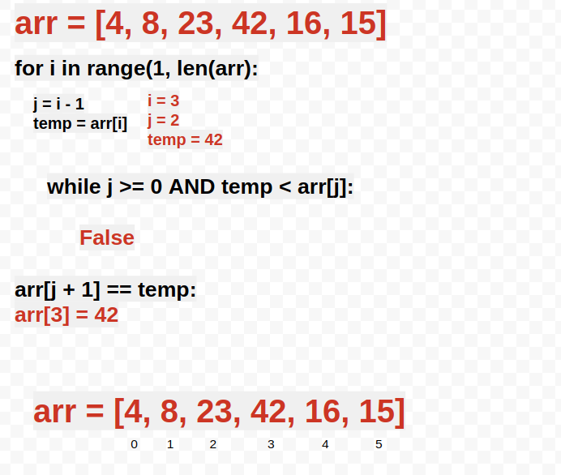
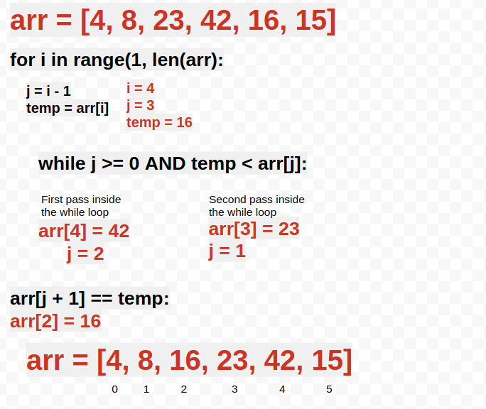
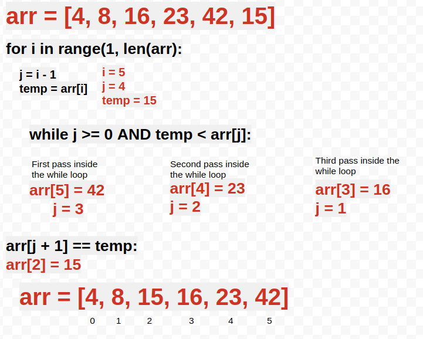

# Insertion Sort

Selection Sort is a sorting algorithm that traverses the array multiple times as it slowly builds out the sorting sequence. The traversal keeps track of the minimum value and places it in the front of the array which should be incrementally sorted.


## Input/Output

```
input 
arr = [8,4,23,42,16,15]

returns [4,8,15,16,23,42]
```

## Pseudocode
```
  InsertionSort(int[] arr)
  
    FOR i = 1 to arr.length
    
      int j <-- i - 1
      int temp <-- arr[i]
      
      WHILE j >= 0 AND temp < arr[j]
        arr[j + 1] <-- arr[j]
        j <-- j - 1
        
      arr[j + 1] <-- temp
```

## Algorithm

- Loop through the array starting at index 1
- Create a new variable j and assigned it to the value of i -1 (or previuos index)
- Hold the value of current index in a temp variable
- while j is greater or equal than 0 AND temp is smaller than array at position j:
    - j = j - 1
- Assign temp to arr at position j + 1

## **Step by step solution**

We are going to sort an array using Insertion Sort.

Input: arr = [8,4,23,42,16,15]

### **Step 1**

We start with the first index of the array. Since 4 is smaller than 8, we move 8 one position to the right and move 4 one position to the left



### **Step 2**

We move to the next index. In this case, 23 is not smaller than 8 so the condition for the while loop is false. 



### **Step 3**

We move to the next index. In this case, 42 is not smaller than 23 so the condition for the while loop is false. 



### **Step 4**

We move to the next index. In this case, 16 is smaller than 42. We enter the while loop and we move 42 one position to the right. Since 16 is also smaller than 23, we move 23 one position to the right. Then we insert 16 in the position 2 of the array



### **Step 5**

We move to the next index. This is a similar case as the previous step. In this case, 15 is smaller than 42. We enter the while loop and we move 42 one position to the right. Since 15 is also smaller than 23, we move 23 one position to the right. Then 15 is also smaller than 16, so we move 16 one position to the right. Then we insert 15 in the position 2 of the array




Since the lenght of the array is 5, the for loop will be completed. The function will return the sorted array. 