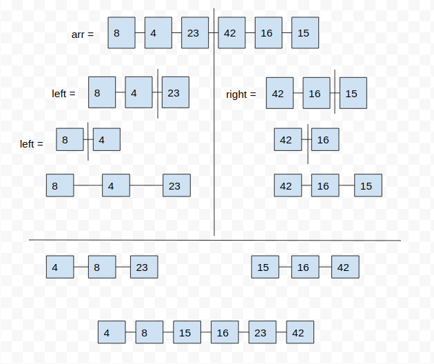

# Merge Sort

Merge Sort is a sorting algorithm that traverses the array multiple times as it slowly builds out the sorting sequence. The traversal keeps track of the minimum value and places it in the front of the array which should be incrementally sorted.


## Input/Output

```
input 
arr = [8,4,23,42,16,15]

returns [4,8,15,16,23,42]
```

## Pseudocode
```
ALGORITHM Mergesort(arr)
    DECLARE n <-- arr.length
           
    if n > 1
      DECLARE mid <-- n/2
      DECLARE left <-- arr[0...mid]
      DECLARE right <-- arr[mid...n]
      // sort the left side
      Mergesort(left)
      // sort the right side
      Mergesort(right)
      // merge the sorted left and right sides together
      Merge(left, right, arr)

ALGORITHM Merge(left, right, arr)
    DECLARE i <-- 0
    DECLARE j <-- 0
    DECLARE k <-- 0

    while i < left.length && j < right.length
        if left[i] <= right[j]
            arr[k] <-- left[i]
            i <-- i + 1
        else
            arr[k] <-- right[j]
            j <-- j + 1
            
        k <-- k + 1

    if i = left.length
       set remaining entries in arr to remaining values in right
    else
       set remaining entries in arr to remaining values in left
```

## Algorithm

- declare n to the value of len(arr)
- cut the array in half and declare to a variable mid
- declare left to the array in range 0, mid
- declare right to the array in range mid, n
- Using recursive 
  - call the merge_sort function passing the left array
  - call the merge_sort function passing the right array

- call the a helper merge function passing the left, right and original array

The helper function will:
- declare i as 0
- declare j as 0
- declare k as 0

- while i is smaller than the length of left AND j is smaller than the length of right:
  - if left at position i smaller or equal to right at position j:
    - assign array at position k the value of 
    left at position i
    - i = i + 1
  
  - else:
    - assign array at position k the value of right at position j
    - j = j + 1
  
  - k = k + 1

- if i is equal to len(left):
  - set remaining entries in arr to remaining values in right
- else
  - set remaining entries in arr to remaining values in left


## **Step by step solution**

We are going to sort an array using Insertion Sort.

Input: arr = [8,4,23,42,16,15]

### **Step 1**

First we assigned the value of len(arr) to a variable n

### **Step 2**

if n is greater than 1

- cut the array in half and assign the value to mid
- assign left to arr[:mid]
- assign right to arr[mid:]

- use recursive to repeat the same process until n is smaller than 1

- Once the the array is divided into smaller arrays/units, we begin merging the 2 sorted halfs (left and right)

