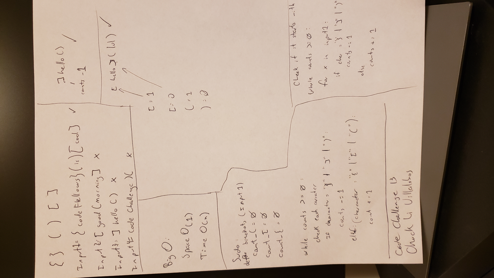

### Code Challenge #13
Multi-bracket Validation

Your function should take a string as its only argument, and should return a boolean representing whether or not the brackets in the string are balanced. There are 3 types of brackets:

Round Brackets : ()
Square Brackets : []
Curly Brackets : {}

### White Board

### Tests
**Input** | **Output**
|---|:---:|
{} | TRUE
{}(){} | TRUE
()[[Extra Characters]] | TRUE
(){}[[]] | TRUE
{}{Code}[Fellows](()) | TRUE
[({}] | FALSE
(]( | FALSE
{(}) | FALSE

**Input** | **Output** | **Why**
|---|:---:|:---:|
{ | FALSE | error unmatched opening { remaining.
) | FALSE | error closing ) arrived without corresponding opening.
[} | FALSE | error closing }. Doesn’t match opening (.