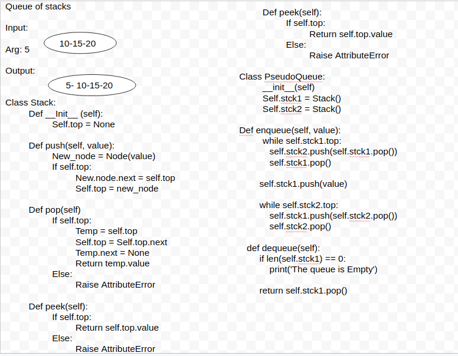

# Queues with Stacks
Create a brand new PseudoQueue class. Do not use an existing Queue. Instead, this PseudoQueue class will implement our standard queue interface (the two methods listed below), but will internally only utilize 2 Stack objects. Ensure that you create your class with the following methods:

- enqueue(value) which inserts value into the PseudoQueue, using a first-in, first-out approach.
- dequeue() which extracts a value from the PseudoQueue, using a first-in, first-out approach.

The Stack instances have only push, pop, and peek methods. You should use your own Stack implementation. Instantiate these Stack objects in your PseudoQueue constructor.

## White Board

## Example
**enqueue(value)**
Input: [10]->[15]->[20]
Args: 5
Output: [5]->[10]->[15]->[20]

Input: 
Args: 5
Output: [5]

**dequeue()**
Input: [5]->[10]->[15]->[20]
Output: 20 
Internal State: [5]->[10]->[15]

Input: [5]->[10]->[15]
Args: 15
Internal State: [5]->[10]

## Tests