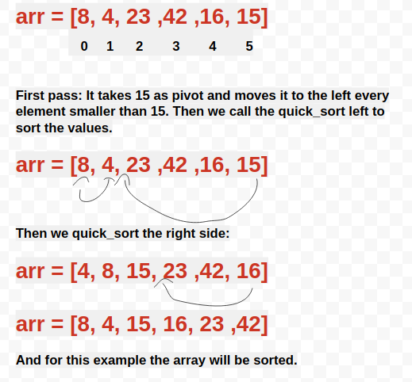

# Quick Sort

Quick Sort takes an array, a left index (0) and a right index (n).
It takes the value of the last index (pivot) and divides the array into two sections. It sorts everything smaller than pivot (left side) then 

## Input/Output

```
input 
arr = [8,4,23,42,16,15]

returns [4,8,15,16,23,42]
```

## Pseudocode
```
ALGORITHM QuickSort(arr, left, right)
    if left < right
        // Partition the array by setting the position of the pivot value 
        DEFINE position <-- Partition(arr, left, right)
        // Sort the left
        QuickSort(arr, left, position - 1)
        // Sort the right
        QuickSort(arr, position + 1, right)

ALGORITHM Partition(arr, left, right)
    // set a pivot value as a point of reference
    DEFINE pivot <-- arr[right]
    // create a variable to track the largest index of numbers lower than the defined pivot
    DEFINE low <-- left - 1
    for i <- left to right do
        if arr[i] <= pivot
            low++
            Swap(arr, i, low)

     // place the value of the pivot location in the middle.
     // all numbers smaller than the pivot are on the left, larger on the right. 
     Swap(arr, right, low + 1)
    // return the pivot index point
     return low + 1

ALGORITHM Swap(arr, i, low)
    DEFINE temp;
    temp <-- arr[i]
    arr[i] <-- arr[low]
    arr[low] <-- temp
```

## Algorithm

- Quick_sort function takes an array, the first index of the array as left, and the last index of the array as right. 

- If left is smaller than right:
    - Assigns position to the value of partition.
    - Quick_sort passing arr, left, position -1
    - Quick _sort passing arr, position + 1, right

- Partition takes the array, left and right
- It assigns low value to left - 1
- It assigns pivot to arr[right]
- It loops through i in range left, right
- if value at position i <= pivot, increases low by 1
    - Swaps the values of arr[i] and arr[low]


## **Step by step solution**

We are going to sort an array using Quick Sort.

Input: arr = [8,4,23,42,16,15]
indexes=      0 1 2  3  4  5

### **Step 1**

First we call our function with the arr, left=0 and right=5

### **Step 2**

if left < right
- it assigns pivot to arr[right]. In this case pivot = 15
- it moves all values greater than 15 to the right 
- using recursion:
    - it sorts the left side
    - it sorts the right side


