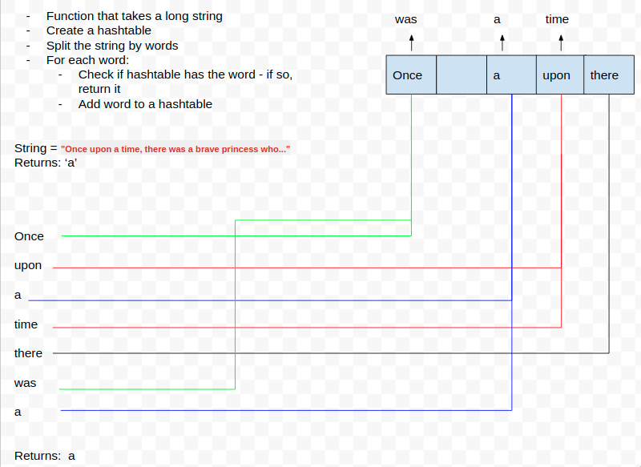

# Repeated Word

### Code Challenge #31
Write a function that accepts a lengthy string parameter.
Without utilizing any of the built-in library methods available to your language, return the first word to occur more than once in that provided string.

### White Board 

### **Tests** 

**Input:** "Once upon a time, there was a brave princess who..."	

**Output:** "a"

**Input:** " It was the best of times, it was the worst of times, it was the age of wisdom, it was the age of foolishness, it was the epoch of belief, it was the epoch of incredulity, it was the season of Light, it was the season of Darkness, it was the spring of hope, it was the winter of despair, we had everything before us, we had nothing before us, we were all going direct to Heaven, we were all going direct the other way – in short, the period was so far like the present period, that some of its noisiest authorities insisted on its being received, for good or for evil, in the superlative degree of comparison only..."	

**Output:** "it"

**Input:** "It was a queer, sultry summer, the summer they electrocuted the Rosenbergs, and I didn’t know what I was doing in New York..."	

**Output:** "summer"

## Author

[Chuck Li Villalobos](https://github.com/ticochuck)