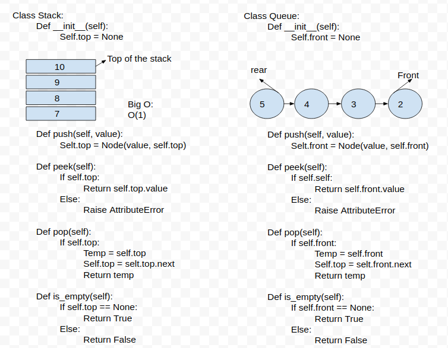

# Stacks and Queues
Create a Stack and Queue classes and their methods to push/add nodes to the top stack or front of the queue. Also to pop, peek and check if it is empty

## White Board

## Tests

- Can successfully push onto a stack
- Can successfully push multiple values onto a stack
- Can successfully pop off the stack
- Can successfully empty a stack after multiple pops
- Can successfully peek the next item on the stack
- Can successfully instantiate an empty stack
- Calling pop or peek on empty stack raises exception
- Can successfully enqueue into a queue
- Can successfully enqueue multiple values into a queue
- Can successfully dequeue out of a queue the expected value
- Can successfully peek into a queue, seeing the expected value
- Can successfully empty a queue after multiple dequeues
- Can successfully instantiate an empty queue
- Calling dequeue or peek on empty queue raises exception

## Approach & Efficiency
All methods are O1

