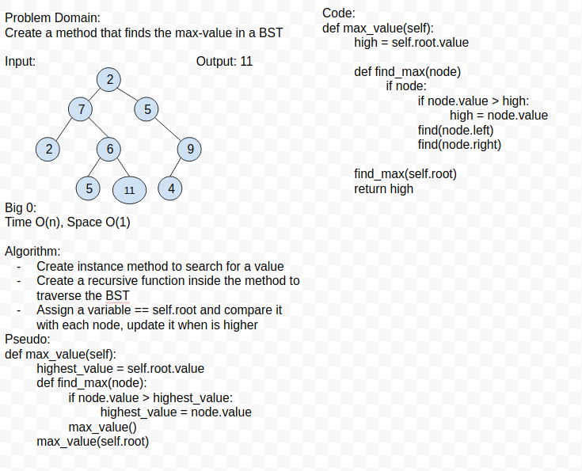

# Binary Tree

## Features 

- Create a Node class that has properties for the value stored in the node, the left child node, and the right child node.

- Create a BinaryTree class
    - Define a method for each of the depth first traversals called preOrder, inOrder, and postOrder which returns an array of the values, ordered appropriately.

- Any exceptions or errors that come from your code should be semantic, capturable errors. For example, rather than a default error thrown by your language, your code should raise/throw a custom, semantic error that describes what went wrong in calling the methods you wrote for this lab.

- Create a BinarySearchTree class
Define a method named add that accepts a value, and adds a new node with that value in the correct location in the binary search tree.
- Define a method named contains that accepts a value, and returns a boolean indicating whether or not the value is in the tree at least once.

- Write an instance method called find-maximum-value. Without utilizing any of the built-in methods available to your language, return the maximum value stored in the tree. You can assume that the values stored in the Binary Tree will be numeric.

- Write a breadth first traversal method which takes a Binary Tree as its unique input. Without utilizing any of the built-in methods available to your language, traverse the input tree using a Breadth-first approach, and return a list of the values in the tree in the order they were encountered.

## White Board

## Tests

- Can successfully instantiate an empty tree
- Can successfully instantiate a tree with a single root node
- Can successfully add a left child and right child to a single root node
- Can successfully return a collection from a preorder traversal
- Can successfully return a collection from an inorder traversal
- Can successfully return a collection from a postorder traversal

