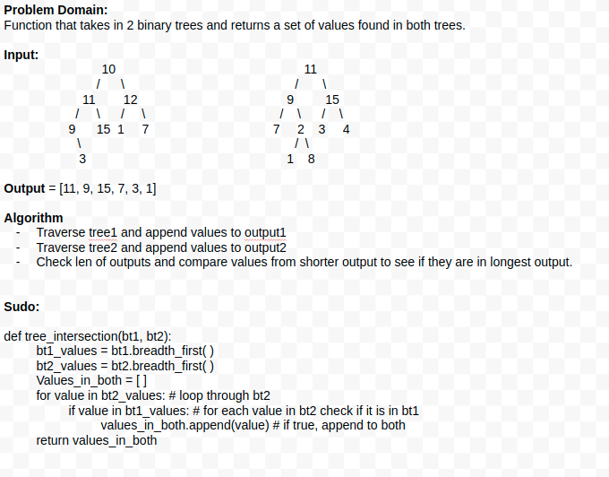

# Tree Intersection

### Code Challenge #32
- Write a function called tree_intersection that takes two binary tree parameters.
- Return a set of values found in both trees.

### White Board 

### Tests 
Inputs:

bt1 = 10-->11-->12-->9-->15-->1-->7-->3
bt2 = 11-->9-->15-->7-->2-->3-->4-->1-->8

Output:

[11,9,15,7,3,1]

## Author

[Chuck Li Villalobos](https://github.com/ticochuck)